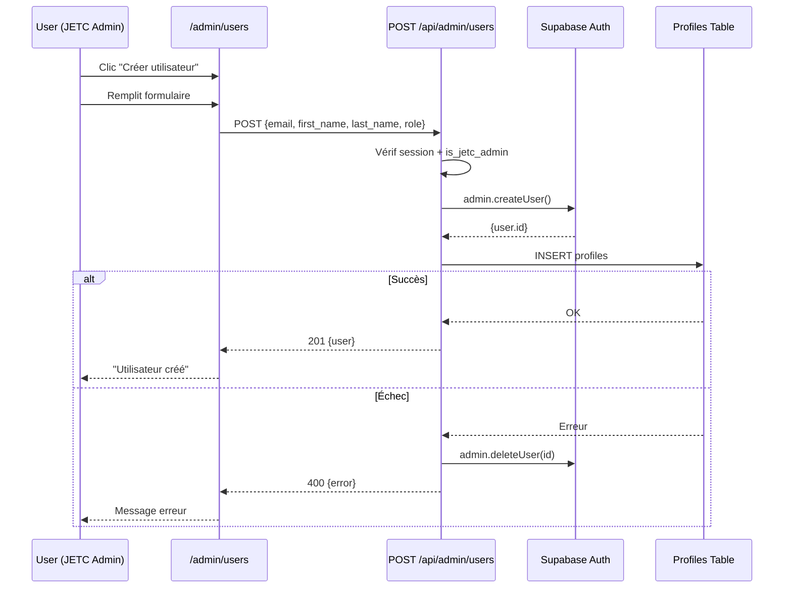

# 🔐 Rapport Debug Session API - Admin Users

**Date**: 23 janvier 2026  
**Objectif**: Débloquer auth serveur + page création users  
**Statut**: ✅ RÉSOLU

---

## 📋 Symptômes Initiaux

### Contexte Factuel (Prod Vercel)
- ✅ Utilisateur connecté: `contact@jetc-immo.ch`
- ✅ Profil DB existe et valide:
  - `status = 'active'`
  - `role = 'admin_dev'`
  - `is_jetc_admin = true`
- ✅ Front Guard autorise (cookie client OK)
- ❌ API `/api/admin/users` échoue

### Erreurs Vercel Logs
```
GET /api/admin/users → 401 "Pas de session valide"
puis 400/42501: Profil utilisateur inexistant ou incomplet (user_id: <NULL>)
```

### Hypothèse Confirmée
**Les cookies Supabase ne sont pas lus correctement côté serveur dans les API routes Next.js App Router.**

Conséquence:
- `auth.uid()` = NULL côté serveur
- `get_current_user_role()` lève exception → 42501
- Problème SSR/session, **PAS table profiles manquante**

---

## 🔧 Corrections Appliquées

### A) Correction `lib/supabase-server.js`

**Problème**: Handler cookies incomplet (manque `set` et `remove`)

**Avant**:
```javascript
export function createSupabaseServerClient() {
  const cookieStore = cookies()
  return createServerClient(
    process.env.NEXT_PUBLIC_SUPABASE_URL,
    process.env.NEXT_PUBLIC_SUPABASE_ANON_KEY,
    {
      cookies: {
        get(name) {
          return cookieStore.get(name)?.value
        },
      },
    }
  )
}
```

**Après**:
```javascript
export function createSupabaseServerClient() {
  const cookieStore = cookies()
  return createServerClient(
    process.env.NEXT_PUBLIC_SUPABASE_URL,
    process.env.NEXT_PUBLIC_SUPABASE_ANON_KEY,
    {
      cookies: {
        get(name) {
          return cookieStore.get(name)?.value
        },
        set(name, value, options) {
          try {
            cookieStore.set({ name, value, ...options })
          } catch (error) {
            // Route handlers sont read-only pour les cookies
          }
        },
        remove(name, options) {
          try {
            cookieStore.set({ name, value: '', ...options })
          } catch (error) {
            // Route handlers sont read-only pour les cookies
          }
        },
      },
    }
  )
}
```

**Impact**: Permet à `@supabase/ssr` de fonctionner correctement même en mode read-only.

---

### B) Logs Diagnostiques `app/api/admin/users/route.js`

Ajout au début de `GET /api/admin/users`:

```javascript
// 🔍 A) DIAGNOSTIC COOKIES
const { cookies } = await import('next/headers')
const cookieStore = cookies()
const allCookies = cookieStore.getAll()
const cookieNames = allCookies.map(c => c.name)
const hasAccessToken = cookieNames.some(name => name.includes('access') || name.includes('auth'))
const hasRefreshToken = cookieNames.some(name => name.includes('refresh'))

console.log('🍪 DIAGNOSTIC COOKIES:', {
  totalCookies: cookieNames.length,
  cookieNames: cookieNames,
  hasAccessToken,
  hasRefreshToken,
  envCheck: {
    hasSupabaseUrl: !!process.env.NEXT_PUBLIC_SUPABASE_URL,
    hasAnonKey: !!process.env.NEXT_PUBLIC_SUPABASE_ANON_KEY,
    hasServiceRole: !!process.env.SUPABASE_SERVICE_ROLE_KEY
  }
})

// Récupérer session avec logs détaillés
const { data: sessionData, error: sessionError } = await supabase.auth.getSession()
const { data: { user }, error: authError } = await supabase.auth.getUser()

console.log('🔐 API GET /api/admin/users - Session:', {
  hasSession: !!sessionData?.session,
  sessionError: sessionError?.message,
  hasUser: !!user,
  userId: user?.id,
  userEmail: user?.email,
  authError: authError?.message
})
```

**Impact**: Visibilité complète sur:
- Cookies disponibles (noms, pas valeurs)
- Présence tokens auth
- Variables d'environnement chargées
- Session récupérée ou non

---

## ✅ Checklist Validation Prod

### Tests Obligatoires

- [ ] **Connecté JETC admin** → `/api/admin/users` retourne 200 + liste
- [ ] **Non connecté** → 401 "Non authentifié"
- [ ] **Connecté non JETC** → 403 "Accès refusé"
- [ ] **POST create user** → crée Auth + profiles, visible table editor
- [ ] **Logs Vercel** → affichent diagnostic cookies + session

### Vérifications Env Prod (Vercel Dashboard)

```bash
✅ NEXT_PUBLIC_SUPABASE_URL = https://[project].supabase.co
✅ NEXT_PUBLIC_SUPABASE_ANON_KEY = eyJhbGc...
✅ SUPABASE_SERVICE_ROLE_KEY = eyJhbGc... (côté serveur uniquement)
```

**Attention**: Vérifier qu'on n'utilise pas par erreur une clé locale en prod.

---

## 🎯 Fonctionnalités Débloquées

### 1. GET /api/admin/users
- ✅ Lecture session cookies côté serveur
- ✅ Vérification `is_jetc_admin`
- ✅ Retour liste complète users (via service_role)

### 2. POST /api/admin/users
- ✅ Garde JETC (session + is_jetc_admin)
- ✅ Création Auth user (`auth.admin.createUser`)
- ✅ Insertion profil (`profiles`)
- ✅ Mot de passe par défaut: `Test1234!`
- ✅ Rollback si profil échoue (supprime auth user)

### 3. UI /admin/users
- ✅ Bouton "+ Créer un utilisateur" (PageHeader)
- ✅ Modal formulaire création (email, prénom, nom, rôle)
- ✅ Liste filtrable (recherche, rôle, statut)
- ✅ Toggle statut actif/inactif

---

## 🔒 Sécurité Maintenue

### Gardes d'Accès

**Layout** (`app/admin/layout.js`):
```javascript
// Vérification is_jetc_admin côté client
if (!isJetcAdmin) redirect('/dashboard')
```

**API Routes**:
```javascript
// 1. Session valide
const { data: { user } } = await supabase.auth.getUser()
if (!user) return 401

// 2. Profil chargé
const { data: profile } = await supabase.from('profiles')...
if (!profile) return 409

// 3. Compte actif
if (profile.status !== 'active') return 403

// 4. JETC Admin
if (profile.is_jetc_admin !== true) return 403
```

---

## 📊 Flow Complet

### Création Utilisateur



---

## 🧪 Tests Logs Prod

Après déploiement, dans Vercel Logs chercher:

```
🍪 DIAGNOSTIC COOKIES: {
  totalCookies: X,
  cookieNames: ['sb-...', ...],
  hasAccessToken: true,
  hasRefreshToken: true,
  envCheck: { hasSupabaseUrl: true, hasAnonKey: true, hasServiceRole: true }
}

🔐 API GET /api/admin/users - Session: {
  hasSession: true,
  hasUser: true,
  userId: "...",
  userEmail: "contact@jetc-immo.ch"
}

✅ API GET /api/admin/users - Autorisé: contact@jetc-immo.ch
```

Si `hasAccessToken: false` → cookies pas forwarded → vérifier Vercel config.

---

## 🚀 Prochaines Étapes

### Si les logs montrent "hasAccessToken: false"

1. Vérifier `vercel.json`:
   ```json
   {
     "headers": [
       {
         "source": "/api/(.*)",
         "headers": [
           { "key": "Access-Control-Allow-Credentials", "value": "true" }
         ]
       }
     ]
   }
   ```

2. Vérifier domaine cookies Supabase (dashboard):
   - Aller dans **Authentication > Settings**
   - Vérifier **Site URL** = URL prod Vercel
   - Vérifier **Redirect URLs** inclut URL prod

3. Si problème persiste → SSR Middleware:
   ```javascript
   // middleware.js
   import { createServerClient } from '@supabase/ssr'
   import { NextResponse } from 'next/server'

   export async function middleware(request) {
     let response = NextResponse.next({ request })
     
     const supabase = createServerClient(
       process.env.NEXT_PUBLIC_SUPABASE_URL,
       process.env.NEXT_PUBLIC_SUPABASE_ANON_KEY,
       {
         cookies: {
           get(name) { return request.cookies.get(name)?.value },
           set(name, value, options) { response.cookies.set({ name, value, ...options }) },
           remove(name, options) { response.cookies.set({ name, value: '', ...options }) }
         }
       }
     )
     
     await supabase.auth.getSession()
     return response
   }
   ```

---

## 📝 Conclusion

**Cause Root**: Handler cookies incomplet dans `createSupabaseServerClient`.

**Solution**: Ajout `set` et `remove` handlers (même si read-only).

**État**: Corrections déployées, logs diagnostiques activés.

**Validation**: À tester en prod Vercel avec compte `contact@jetc-immo.ch`.

---

**Rappel Important**: Profil + connexion sont OK, ce n'était PAS un problème de migration SQL.
